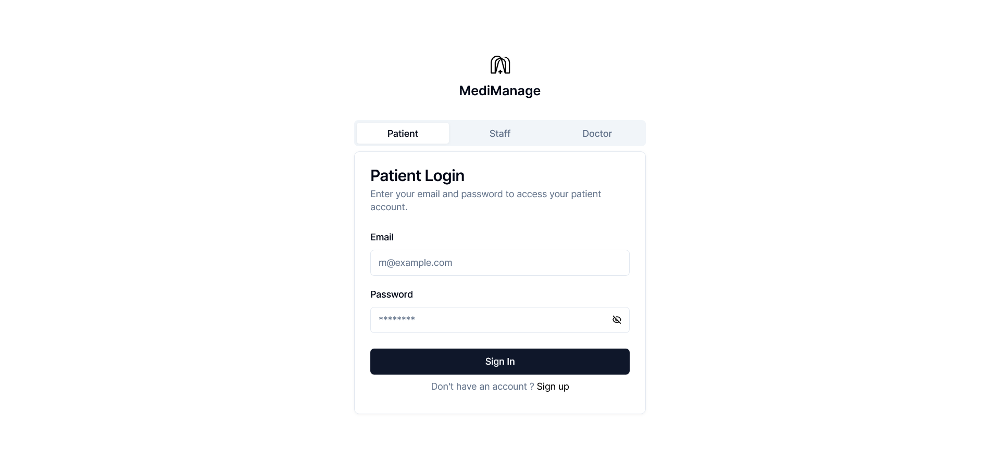
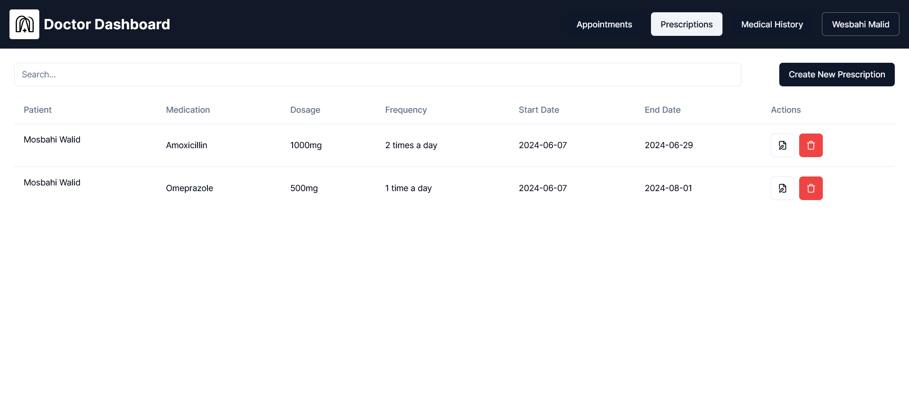
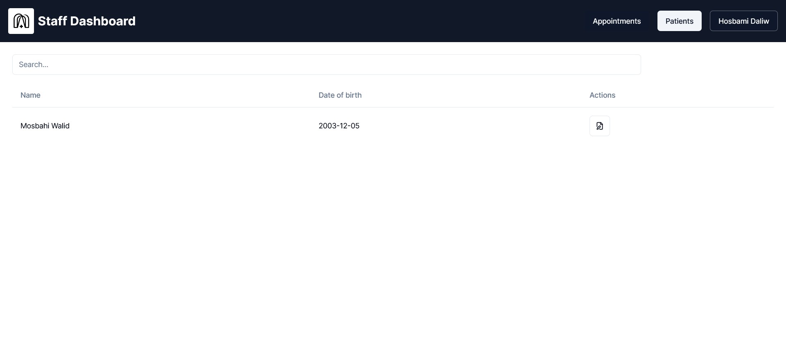
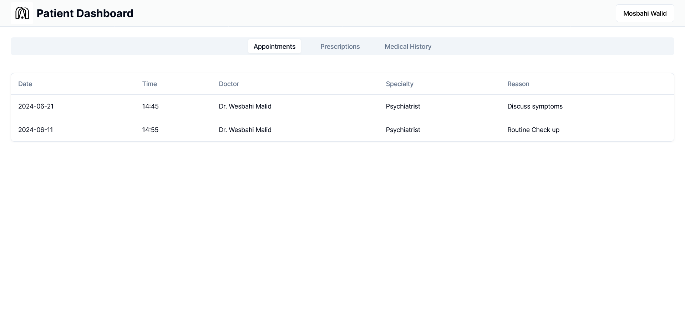
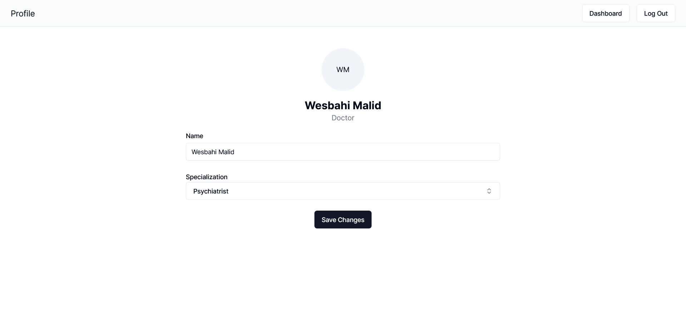

# Medimanage

An mvp of a medical office managment service.

## Run Locally

Run the backend

```bash
  cd itexc/pocketbase
  pocketbase serve
```

Install dependencies

```bash
  npm install
  npm run dev
```

## API Reference

#### Get all items

Because of the time constraint I used a CMS called pocketbase to handle the boring crud routes so once you run the backend you can find the API refrences at [localhost:8090/_/](https://localhost:8090/_/).
Once I was done with the backend I thought I'd give it a front end to go along with and you can check that out at [localhost:3000](https://localhost:3000).

## Screenshots








